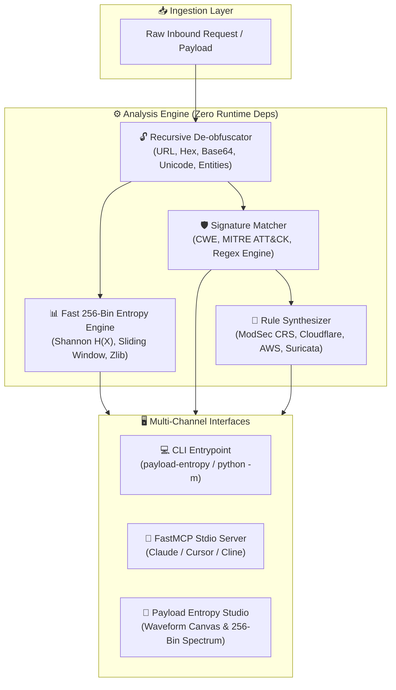

# 🛡️ Payload Entropy Studio

[](https://github.com/1nc0gn30/payload-entropy-studio/actions)
[](https://www.python.org/downloads/)
[](https://github.com/1nc0gn30/payload-entropy-studio)
[](https://modelcontextprotocol.io/)
[](https://opensource.org/licenses/MIT)

> **Security Payload Threat Analyzer, Shannon Entropy Profiler & WAF Rule Synthesizer with Material 3 Web UI, Multi-OS CLI, FastMCP stdio server, and zero external runtime dependencies.**

---

## ✨ Features

- 🛡️ **Multi-Vector Threat Analyzer**: Evaluates input strings for 10+ major attack vectors including SQL Injection, Cross-Site Scripting (XSS), Command Injection, Path Traversal (LFI), Server-Side Template Injection (SSTI), SSRF, XXE, and Prototype Pollution, with automated **CWE** and **MITRE ATT&CK** classification.
- 🔓 **Recursive De-obfuscation Engine**: Unmasks multi-layered evasions across URL percent encoding (including double/triple encoding), Hex escapes, Unicode escapes, Base64 blocks, HTML entities, and string concatenations.
- 📊 **Shannon Entropy & Kolmogorov Complexity Profiler**: Computes global and sliding-window byte entropy ($H(X)$ from 0.0 to 8.0 bits/byte) to instantly detect encrypted reverse shells, packed payloads, and shellcode.
- 🧱 **Automated WAF & IDS Rule Generator**: Automatically synthesizes production-ready defense rules in **ModSecurity 3 / OWASP CRS**, **Cloudflare WAF Expression**, **AWS WAF v2 JSON**, and **Suricata IDS**.
- 🎨 **Payload Entropy Studio Web UI**: Real-time payload decoder, entropy spectrum visualizer, interactive attack sample library, and 1-click rule copy (design influenced by Material 3 tokens).
- ⚡ **Zero Third-Party Runtime Dependencies**: 100% Python Standard Library runtime (`re`, `math`, `zlib`, `collections`, `urllib`, `html`, `base64`, `http.server`, `argparse`).
- 🤖 **FastMCP Server Protocol**: Full Model Context Protocol (MCP) JSON-RPC 2.0 stdio server for Claude Desktop, Cursor, Cline, and autonomous AI agents.

---

## 🚀 Quick Start

### Installation
```bash
# Clone the repository
git clone https://github.com/1nc0gn30/payload-entropy-studio.git
cd payload-entropy-studio

# Install in editable mode
pip install -e .
```

---

## 💻 CLI Usage

```bash
# Analyze a suspicious attack payload
payload-entropy analyze "%3Cscript%3Ealert(document.cookie)%3C/script%3E"

# Recursively de-obfuscate a multi-layered payload
payload-entropy deobfuscate "%252e%252e%252f%252e%252e%252fetc%2fpasswd"

# Profile Shannon entropy and byte distribution
payload-entropy entropy "payload.bin" --window-size 32

# Synthesize WAF rules (ModSecurity, Cloudflare, AWS WAF, Suricata)
payload-entropy waf "1' UNION SELECT 1,username,password FROM users--"

# Launch Payload Studio Web UI (Material 3 influenced)
payload-entropy serve --port 8095

# Start FastMCP stdio server for LLM agents
payload-entropy mcp

# Run system diagnostics
payload-entropy doctor
```

---

## 🤖 Model Context Protocol (MCP) Setup

Add `payload-entropy-studio` to your Claude Desktop or Cursor configuration:

```json
{
  "mcpServers": {
    "payload-entropy": {
      "command": "python3",
      "args": ["-m", "payload_entropy_studio", "mcp"]
    }
  }
}
```

### Registered MCP Tools:
- `payload_analyze`: Full multi-vector threat analysis, risk scoring, CWE & MITRE ATT&CK mapping.
- `payload_deobfuscate`: Step-by-step recursive de-obfuscation history.
- `payload_entropy`: Shannon entropy score, sliding window heatmap, and byte distribution.
- `payload_waf_rules`: Synthesize ModSecurity, Cloudflare, AWS WAF, and Suricata rules.
- `payload_diagnostics`: Platform and toolchain health check.

---

## 📐 Mathematical Foundations

### Shannon Entropy Formulation
Shannon Entropy measures the average rate at which information is produced by a stochastic data source. For an arbitrary payload of bytes $X = (x_1, x_2, \dots, x_N)$ over the byte alphabet $\Sigma = \{0, 1, \dots, 255\}$:

$$H(X) = -\sum_{i=0}^{255} p(x_i) \log_2 p(x_i) \quad (\text{bits per byte})$$

where $p(x_i) = \frac{\text{count}(x_i)}{N}$ denotes the empirical probability of occurrence for byte value $x_i$.

### Entropy Threshold Classification Spectrum

| Entropy Range ($H(X)$) | Classification | Typical Payloads & Attack Signatures |
| :--- | :--- | :--- |
| **0.00 – 1.50 bits** | Uniform / Highly Repetitive | Padding sequences (`\x00*1000`), NOP sleds (`\x90*500`) |
| **1.50 – 4.50 bits** | Natural Language & HTML | Plaintext HTTP requests, JSON bodies, English queries |
| **4.50 – 5.60 bits** | Source Code & Scripts | JavaScript vectors, SQL queries, PHP scripts |
| **5.60 – 6.80 bits** | Obfuscated & Encoded Data | Base64-encoded blobs, URL-encoded exploit chains |
| **6.80 – 8.00 bits** | High-Entropy / Packed / Crypto | Polymorphic shellcode, encrypted C2 payloads, AES ciphertext |

### Kolmogorov Complexity Approximation
Because true algorithmic Kolmogorov Complexity $K(s)$ is formally uncomputable, this studio computes a practical upper bound via DEFLATE/Zlib algorithmic compression ratio:

$$\hat{K}(s) = \frac{|\text{Compress}(s)|}{|s|}$$

---

## 🏛️ Architecture



---

## 🐍 Python SDK API Reference

```python
from payload_entropy_studio.entropy_engine import analyze_entropy_profile, calculate_shannon_entropy
from payload_entropy_studio.threat_analyzer import ThreatAnalyzer
from payload_entropy_studio.waf_generator import generate_waf_rules

# 1. Calculate Shannon Entropy & 256-bin spectrum
report = analyze_entropy_profile("SELECT * FROM users WHERE id=1;")
print(f"Entropy: {report.shannon_entropy:.2f} bits/byte")
print(f"Classification: {report.classification.value}")
print(f"Printable ASCII: {report.char_classes['printable_pct']:.1f}%")

# 2. Perform deep multi-vector threat analysis
analyzer = ThreatAnalyzer()
threat_report = analyzer.analyze("<script>alert(document.cookie)</script>")
print(f"Threat: {threat_report.primary_threat} (Score: {threat_report.risk_score}/100)")
print(f"CWE: {threat_report.cwe_mappings}")
print(f"MITRE ATT&CK: {threat_report.mitre_attack_mappings}")

# 3. Synthesize production WAF rules
rules = generate_waf_rules(threat_report)
print(rules["modsecurity"])
```

---

## 🧪 Running Tests

```bash
pytest -v
```

---

## 📜 License

MIT License © 2026 1nc0gn30

